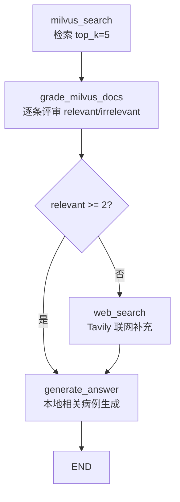

# Corrective RAG 实现

前几篇(naive / hybrid / agentic / parent / self)的检索都默认「检索出来的就是有用的」,这篇换了个思路:检索结果**不一定能用**——加一道「相关性评审」关卡,不相关的就放弃,不够就联网补。这就是 Corrective RAG(纠错 RAG):**校验检索结果,不相关就纠正路径**。

> 📁 [项目源码](https://github.com/matianxing2201/agent_practice/tree/main/app/blueprints/rag/corrective_rag)

## 为什么需要纠错

普通 RAG 的链路是「检索 → 生成」,检索结果**全盘接收**,好坏都喂给 LLM。问题是:向量检索按相似度找,找到的**不一定相关**——比如问「恶寒头痛」,可能召回语义相近但实际无关的病历,LLM 拿它硬编答案,就是幻觉来源。

|              | 普通 RAG    | Corrective RAG            |
| ------------ | ----------- | ------------------------- |
| 检索后       | 直接生成    | 逐条评审相关/不相关       |
| 不相关结果   | 照单全收    | 放弃,不喂给 LLM           |
| 相关资料不足 | 硬编答案    | 转联网搜索补充            |
| 核心         | 检索 → 生成 | 校验检索质量,纠错后再生成 |

## 目录结构

```
corrective_rag/
├── controllers.py      # 路由:/corrective/query(SSE 流式)
├── services.py         # 编排:跑工作流,把答案按块流式输出
├── builder.py          # LangGraph StateGraph 组装
├── nodes.py            # 4 节点 + 1 路由(本篇核心)
├── prompts.py          # 评审 + 生成两个 prompt
├── state.py            # CRAGState
└── __init__.py         # 导入即注册路由
```

## 配置参数 — config.py

```python
"corrective_rag": {
    "COLLECTION_NAME": "tcm_medical_record",  # 复用共享知识库
    "RETRIEVE_TOP_K": 5,                      # 检索候选数(评审后选相关)
    "MIN_RELEVANT_DATA_COUNT": 2,             # 相关资料 ≥ 2 才直接用,否则联网纠错
    "SEARCH_MAX_RESULTS": 3,                  # Tavily 联网返回条数
},
```

> ==`MIN_RELEVANT_DATA_COUNT` 是纠错的分界线:本地相关资料少于它,就走联网路径。==

## 状态定义 — state.py

```python
class CRAGState(TypedDict):
    patient_desc: str        # 患者描述(全程保留)
    milvus_docs: list[str]   # 检索候选(未评审)
    relevant_docs: list[str] # 评审后相关的病例(纠错后留下的)
    web_context: str         # 联网补充上下文(JSON 字符串)
    final_result: str        # 最终诊断
```

## 评审与生成 prompt — prompts.py

评审节点让 LLM 只输出一个英文标记词,用来驱动路由:

```python
grade_milvus_docs_template = ChatPromptTemplate.from_messages([
    ("system", """你是中医病例检索评审专家。
判断检索病例文本是否与用户问诊内容相关。
只输出英文单词：relevant或irrelevant；
禁止输出额外文字。"""),
    ("human", "----患者描述----\n{patient_desc}\n----病例片段----\n{docs_chunk}"),
])
```

## 节点与路由 — nodes.py

**工作流(4 节点 + 1 条件路由):**



**节点 2(评审)是核心**,逐条把候选发给 LLM 判断:

```python
def node_grade_milvus_docs(state: CRAGState) -> CRAGState:
    if not state["milvus_docs"]:
        return state  # ==无候选可评审,路由会走联网==

    for chunk in state["milvus_docs"]:
        result = _invoke(
            prompts.grade_milvus_docs_template,
            patient_desc=state["patient_desc"],
            docs_chunk=chunk,
        ).strip()
        if result == "relevant":
            state["relevant_docs"].append(chunk)  # ==存病例内容,不是评审标记==
```

> ⚠️ **修正参考代码 bug**:参考实现写的是 `append(result)`——把评审标记字符串 `"relevant"` 存进了 `relevant_docs`(错,生成时拿到的是单词不是病历)。这里 `append(chunk)`——存的是**病例内容本身**(对)。

**路由(纠错分叉点):**

```python
def route_decide_to_generate_answer(state: CRAGState) -> str:
    if len(state["relevant_docs"]) >= _scheme()["MIN_RELEVANT_DATA_COUNT"]:
        return "generate_answer"   # 资料够,直接用本地
    return "web_search"            # 不够,联网纠错
```

**节点 3(联网补充)+ 节点 4(生成):**

```python
def node_web_search(state: CRAGState) -> CRAGState:
    from tavily import TavilyClient
    client = TavilyClient(api_key=current_app.config["TAVILY_API_KEY"])
    resp = client.search(query=state["patient_desc"], search_depth="advanced",
                         max_results=_scheme()["SEARCH_MAX_RESULTS"])
    state["web_context"] = json.dumps(resp.get("results", []), ensure_ascii=False)
    return state

def node_generate_answer(state: CRAGState) -> CRAGState:
    state["final_result"] = _invoke(
        prompts.generate_answer_template,
        patient_desc=state["patient_desc"],
        relevant_docs=state["relevant_docs"],
        web_context=state["web_context"] or "无",   # ==本地不足,联网补==
    )
    return state
```

## 工作流组装 — builder.py

```python
graph.add_edge(START, "milvus_search")
graph.add_edge("milvus_search", "grade_milvus_docs")
graph.add_conditional_edges(
    source="grade_milvus_docs",
    path=route_decide_to_generate_answer,
    path_map={"web_search": "web_search", "generate_answer": "generate_answer"},
)
graph.add_edge("web_search", "generate_answer")
graph.add_edge("generate_answer", END)
```

## 编排与流式输出 — services.py

```python
def answer_question_stream(patient_desc: str):
    workflow = build_workflow()
    state = workflow.invoke({...})            # 跑完整个工作流,拿到完整答案
    answer = state["final_result"]
    for piece in [answer[i : i + 20] for i in range(0, len(answer), 20)]:
        yield _sse({"content": piece})        # 按 20 字块输出
    yield _sse({"done": True})
```

> ⚠️ 这是**模拟流式**:`workflow.invoke()` 同步跑完全部节点才返回,答案早已完整,切片是「把成品切开上菜」,不是「边做边端」。真正的流式需要 `workflow.stream(stream_mode="messages")` + 节点内 `.stream()`。参考代码其实也是模拟流式(对完整字符串逐字符切),这里只是按块切、减少事件数。

## 接口 — controllers.py

```text
POST /rag/corrective/query
Content-Type: application/json

{"query": "我恶寒头痛,没有汗,鼻塞流清涕"}
```

返回 SSE 流式:

```text
data: {"content": "### 中医诊断"}
data: {"content": "\n\n**感冒 · 风寒束表证**"}
data: {"content": "\n\n### 辨证依据..."}
...
data: {"done": true}
```

## 小结

**Corrective RAG 的特点**

- 检索结果**不是全盘接收**——逐条评审相关/不相关,不相关就放弃
- 相关资料不足时**转联网搜索补充**,不拿不相关信息硬编答案——这是「纠错」的核心
- 和 Self-RAG 对比:Self-RAG 自省「**检索动作**」(要不要查、够不够用,多轮重检索);CRAG 评审「**检索结果**」(相关才留,不够联网补,一次性纠错)

**适合**

- 可靠性要求高、需要极大程度控制幻觉的场景(专业/学术类 Agent)
- 拥有强大知识库的企业——拿不准就联网,而不是瞎编
- 「专业回答或不知道」——宁可不答也不胡诌

**不适合**

- 需要大胆回复的创意类、想象类 Agent——纠错会抑制发散
- 简单问答——多一道评审调用,更慢更贵
