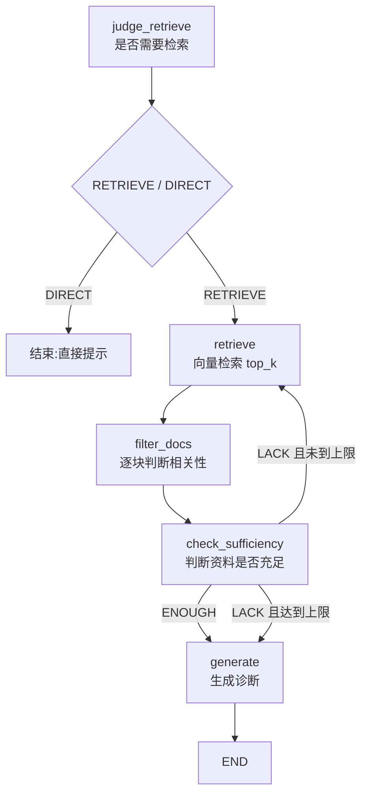

# Self-RAG 实现

Self-RAG（自省 RAG）是在普通 RAG 上增加一层「自我反思」：LLM 不只是回答问题，还要判断：

1. 是否需要检索知识库？
2. 检索到的病例是否相关？
3. 有效资料是否足够？
4. 不足时是否重新检索？

> 📁 [项目源码](https://github.com/matianxing2201/agent_practice/tree/main/app/blueprints/rag/self_rag)

## 工作流



核心链路：

```text
用户输入
  → judge: RETRIEVE / DIRECT
  → retrieve: 向量检索备选病例
  → filter_docs: 逐条筛选有效病例
  → check_sufficiency: ENOUGH / LACK
  → LACK: 清空列表,回到 retrieve 重试
  → ENOUGH: generate 生成最终答案
```

## 状态 `SelfRAGState`

工作流在节点之间传递的是一个普通字典，`TypedDict` 只提供静态类型提示，运行时仍然是 `dict`。

```python
class SelfRAGState(TypedDict):
    patient_msg: str                    # 用户输入,全程保留
    medical_record_list: list[str]      # 检索得到的备选病例
    valid_medical_record_list: list[str] # filter 后的有效病例
    final_result: str | None            # 最终答案或提示
    retrieve_round: int                 # 已检索轮数
```

`workflow.invoke(state)` 返回一个**新的最终状态字典**，不是传入的同一个对象：

```python
result = workflow.invoke(input_state)

type(result)       # dict
result is input_state  # False
result["final_result"] # 最终诊断或提示语
```

节点返回的字典会被 LangGraph 按字段合并进状态；节点没有修改的字段继续保留。

## 节点与路由

| 节点/路由 | 作用 | LLM 输出 |
|---|---|---|
| `node_judge_retrieve` | 判断是否需要查知识库 | `RETRIEVE` / `DIRECT` |
| `node_retrieve` | 向量化用户输入,检索 top-k 病例 | 病例列表 |
| `node_filter_docs` | 对每个备选病例判断相关性 | `YES` / `NO` |
| `node_check_sufficiency` | 判断有效病例是否足够 | `ENOUGH` / `LACK` |
| `node_generate` | 根据有效病例生成诊断 | 自由文本 |
| `route_judge` | 根据 `final_result` 选择结束或检索 | `end` / `retrieve` |
| `route_sufficiency` | 根据列表是否被清空选择重试或生成 | `retrieve` / `generate` |

### `route_sufficiency` 的关键设计

`node_check_sufficiency` 负责**修改状态产生信号**，`route_sufficiency` 负责**读取状态选择方向**：

```python
# LLM 说资料不足且还有重试次数
state["medical_record_list"] = []
state["valid_medical_record_list"] = []

# 路由看到 medical_record_list 为空,回到 retrieve
if not state["medical_record_list"] and round < MAX:
    return "retrieve"
return "generate"
```

路由函数只读状态、不改状态；节点负责动作，路由负责选边。

## 终止条件与边界

```python
if result == "LACK" and retrieve_round < MAX_RETRIEVE_ROUND:
    # 清空后重检索
```

- `ENOUGH`：直接进入 `generate`。
- `LACK` 且未到上限：清空两类列表，回到 `retrieve`。
- `LACK` 且达到上限：不再重试，进入 `generate`。
- `valid_medical_record_list` 为空：不再判断充足性，生成节点返回「暂无可参考资料」提示。
- 知识库为空：`medical_record_list` 一直为空，会重试到 `MAX_RETRIEVE_ROUND` 后兜底。

因此 `MAX_RETRIEVE_ROUND` 是防止自省工作流无限循环的终止阀。

## `_invoke`：Prompt → LLM → 字符串

```python
    return (template | _llm() | StrOutputParser()).invoke(variables)
```

### `template`

通常是 `ChatPromptTemplate`。它接收变量字典，填充模板中的 `{占位符}`：

```python
_invoke(
    prompts.filter_docs_template,
    patient_msg="恶寒头痛",
    doc_chunk="病例一：风寒束表证",
)
```

`variables` 实际是：

```python
{
    "patient_msg": "恶寒头痛",
    "doc_chunk": "病例一：风寒束表证",
}
```

### 管道返回值

```python
template | _llm() | StrOutputParser()
```

这一行只返回一个 `RunnableSequence` 管道对象，还没有调用 LLM。

```python
chain.invoke(variables)
```

才会真正执行：

```text
dict
  → ChatPromptTemplate:填充占位符,生成消息列表
  → ChatOpenAI:返回 AIMessage
  → StrOutputParser:取 AIMessage.content
  → str
```

不加 `StrOutputParser` 时，结果是 `AIMessage`；加上后结果是纯字符串，才能直接和 `"RETRIEVE"`、`"YES"`、`"ENOUGH"` 比较。

## LangGraph 组件关系

```python
graph.add_node("judge_retrieve", node_judge_retrieve)
```

节点本身只是普通 Python 函数，LangGraph 在 `workflow.invoke(state)` 时按图的边自动调用：

```text
build_workflow
  → StateGraph 注册节点/边/条件路由
  → compile() 得到 CompiledStateGraph
  → invoke(state)
  → LangGraph 调用 node(state),合并返回值,继续下一条边
```

`_llm()` 必须在节点执行时调用，因为它读取 Flask 的 `current_app.config`。模块导入时还没有应用上下文，提前实例化会报：

```text
RuntimeError: Working outside of application context
```

## 三种编排方式

| 方式 | 适合 | 状态/流程控制 |
|---|---|---|
| 手写循环 | 想完全掌控 ReAct 细节 | 自己维护 `messages`、工具调用和终止条件 |
| `create_agent` | 标准「模型 ↔ 工具」循环 | 框架管理工具 schema、分发、消息回填、循环 |
| `StateGraph` | 自定义节点、分支、业务状态 | 自定义节点、路由和 `TypedDict` 状态 |

Agentic RAG 使用 `create_agent`，因为它是标准工具循环；Self-RAG 使用 `StateGraph`，因为它需要 `filter_docs`、`check_sufficiency`、`retrieve_round` 等自定义业务流程。

## 接口

```text
POST /rag/self/query
Content-Type: application/json

{"query": "恶寒头痛、鼻塞流清涕"}
```

返回：

```json
{
  "answer": "诊断结果...",
  "sources": ["有效病例片段..."],
  "retrieve_round": 1
}
```

`retrieve_round > 1` 表示发生过「资料不足 → 重检索」。

## 小结

普通 RAG 只执行固定的「检索 → 生成」；Self-RAG 在中间加入了自省控制流。LLM 提供判断意见，LangGraph 的节点和路由负责把判断转成可执行的流程。

相关笔记：[[Naive-RAG实现]]、[[Hybrid-RAG实现]]、[[Agentic-RAG实现]]、[[Parent-Document-RAG实现]]
